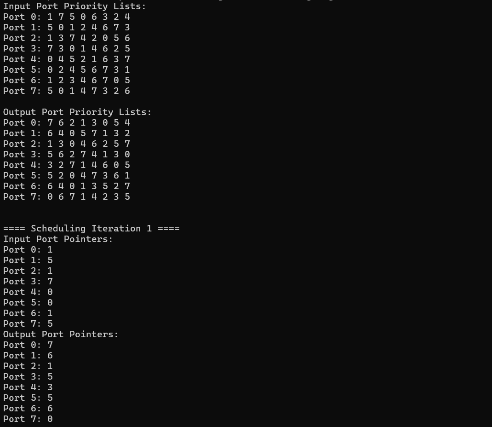
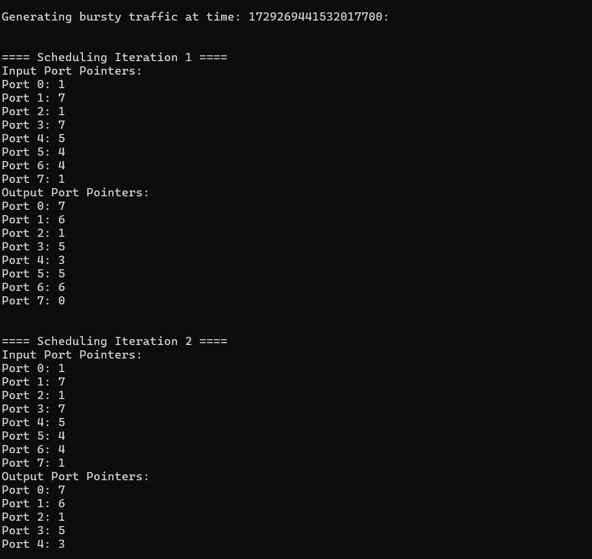
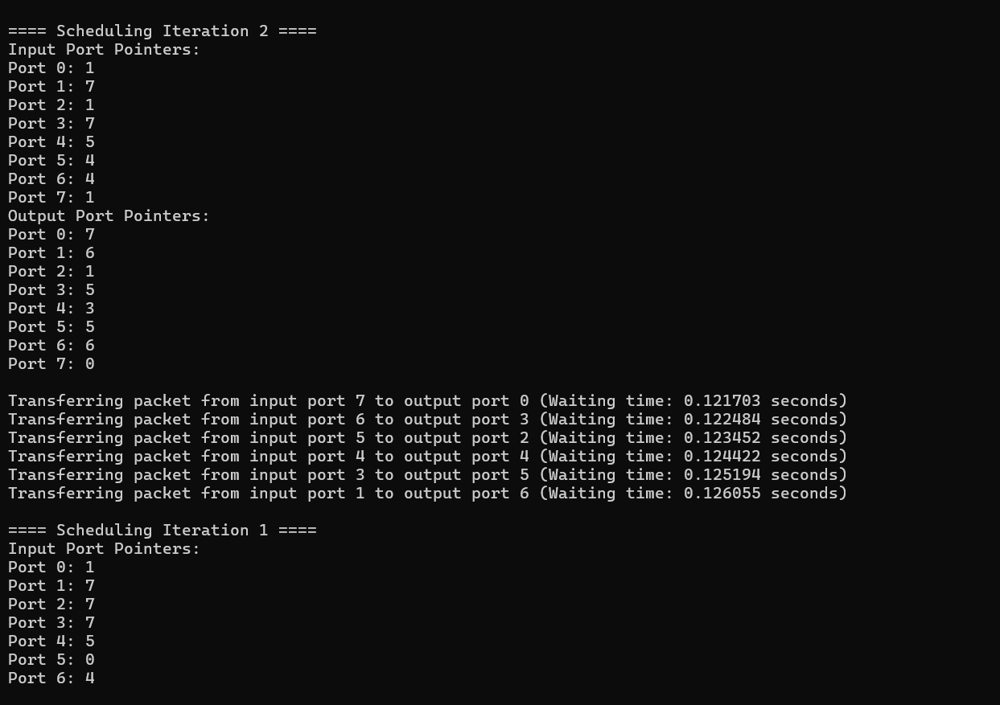
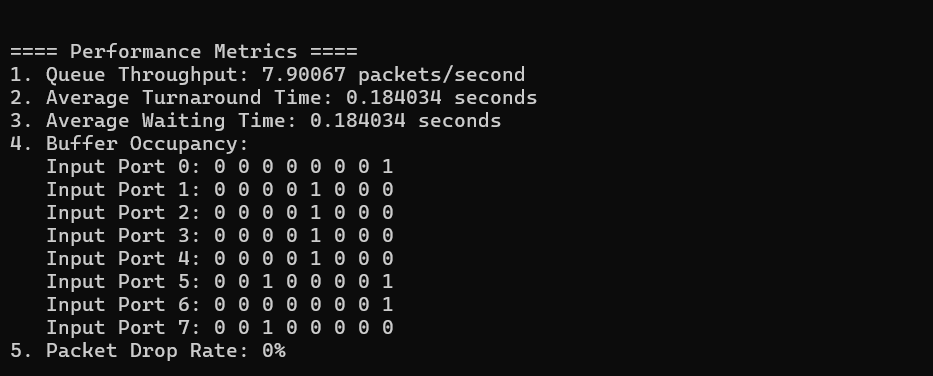

# Router Switch Fabric Simulation

This repository contains a simulation of a router switch fabric that implements two crucial scheduling algorithms: **Round Robin** and **iSLIP**. The simulation effectively addresses the Head-of-Line (HOL) blocking problem by utilizing **Virtual Output Queues (VOQs)**, ensuring efficient packet transfer within the network.

## Features

- **Scheduling Algorithms**: Implements Round Robin and iSLIP scheduling techniques for efficient packet routing.
- **HOL Blocking Solution**: Utilizes Virtual Output Queues to mitigate the Head-of-Line blocking issue.
- **Debugging and Visualization**: The program provides detailed debugging information at each stage, allowing users to understand the scheduling process and packet transfer clearly.
- **Snapshots**: The program outputs crucial information at various stages, which can be visualized through provided snapshots.

## Snapshots

Here are some important snapshots from the simulation:

1. **Initial State**: Displays the initial state of the ports, the priority list, and the initial pointers in the priority list.
   

2. **Packet Generation**: Shows the generation of packets and the first iteration of the scheduling algorithm.
   

3. **Maximal Matching**: Depicts the last iteration before a maximal matching is found and shows the data being transferred.
   

4. **KPM Data Output**: Outputs the KPM (Key Performance Metrics) data after running the simulation for the desired duration.
   

## How to Run the Program

To run the simulation, follow these steps:

1. Clone the repository:

   ```bash
   git clone https://github.com/1ochaku/Router-Switch-Fabric-Simulation
   ```

2. Change to the directory:

   ```bash
   cd Router-Switch-Fabric-Simulation
   ```

3. Compile the source code:

   ```bash
   g++ rr_islip_scheduling.cpp
   ```

4. Execute the program:
   ```bash
   ./a.out
   ```

## Dependencies

- C++ Compiler (g++)
